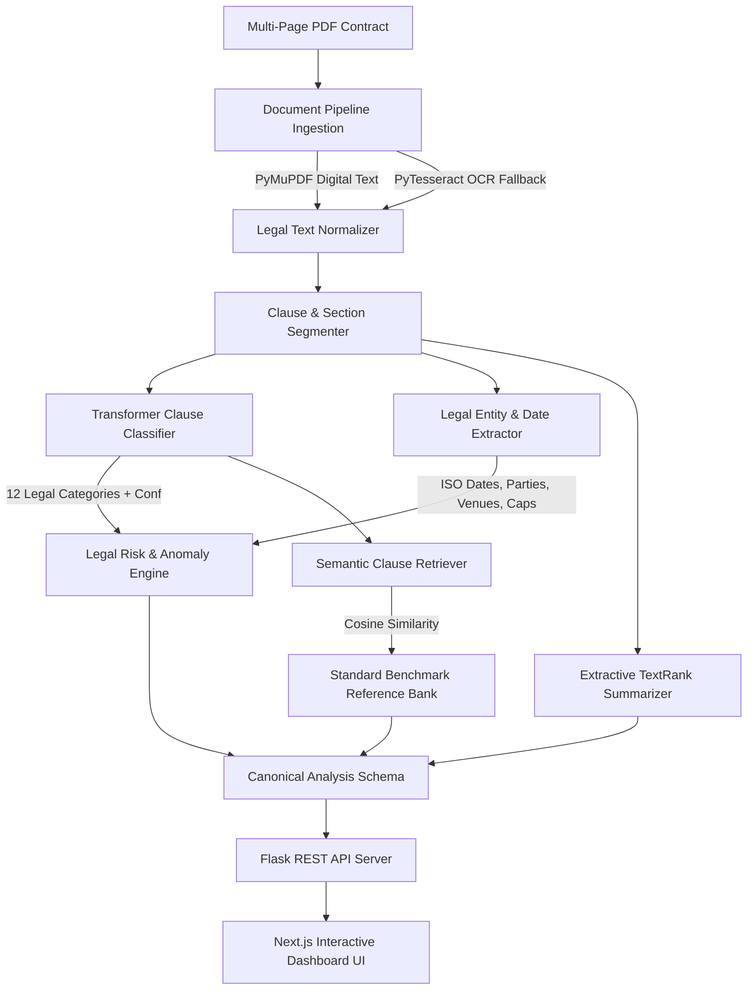

# PIWOT Legal Advisor: Local-First ML/DL Contract Intelligence Platform

[](https://www.python.org/downloads/)
[](https://nextjs.org/)
[](https://opensource.org/licenses/MIT)
[](https://huggingface.co/)
[](https://docs.pytest.org/)

**PIWOT Legal Advisor** is an end-to-end, privacy-preserving legal contract analysis platform. It provides automated multi-page PDF ingestion with OCR fallback, legal clause classification, information extraction (NER / Key Entity Identification), explainable 0–100 risk scoring, anomaly detection, semantic reference benchmark retrieval, and extractive summarization—**running 100% locally on CPU/GPU without external API keys or cloud LLM dependencies**.

---

## 🏛 Architecture Overview



---

## 🚀 Key Capabilities & Modules

1. **Multi-Page Ingestion & OCR Fallback (`ml/preprocessing`)**
   - High-throughput multi-page document parsing via PyMuPDF (`fitz`).
   - Automated scanned-page detection with `pytesseract` OCR fallback when text density is `< 30` characters.
   - Legal-conservative regex text normalization and line/section-aware clause chunking preserving page citations and byte offsets.

2. **Clause Classification ML + DL (`ml/classifiers`)**
   - 12 critical legal categories: `termination`, `governing_law`, `confidentiality`, `indemnification`, `liability`, `payment`, `intellectual_property`, `dispute_resolution`, `warranty`, `force_majeure`, `non_compete`, `miscellaneous`.
   - Production model: Dense embedding representation via `all-MiniLM-L6-v2` + Logistic Classification Head (achieving **80.30% Accuracy** and **79.73% Macro F1**).
   - Fast fallback baseline: TF-IDF n-grams + Logistic Regression with calibrated probability outputs.

3. **Legal NER & Key Information Extraction (`ml/ner`)**
   - Contracting party detection and role attribution (Discloser/Recipient, Buyer/Seller).
   - Multi-format date parsing normalized to ISO 8601 (`YYYY-MM-DD`).
   - Notice period extraction (`30 days`, `immediate written notice`).
   - Financial commitment, currency (`$`, `USD`, `EUR`), percentage penalties, and payment terms (`Net 30`).
   - Governing law jurisdiction and dispute venue resolution.

4. **Explainable Risk Scoring & Contradiction Detection (`ml/risk`)**
   - Composite 0–100 risk score mapped to `Low`, `Medium`, `High` risk levels.
   - Deterministic rule checks: uncapped liability, unilateral termination without cause, non-compete overreach (>24 months / worldwide scope), missing essential boilerplate.
   - Cross-clause anomaly detection: Chronological date contradictions (effective date > expiration date) and multi-jurisdiction conflicts.

5. **Semantic Similarity & Extractive Summarization (`ml/retrieval`, `ml/summarization`)**
   - Nearest-neighbor retrieval against standard market reference clauses with cosine similarity scores.
   - Zero-LLM graph-based TextRank extractive summarization with page citations.

---

## 📊 Evaluation Benchmark Results

All metrics were empirically evaluated on multi-page benchmark contracts using local execution:

| Module / Evaluation Metric | Classical Baseline (TF-IDF) | Production Model (Transformer + Rules) | Status |
| :--- | :--- | :--- | :--- |
| **Clause Classification Accuracy** | 56.06% | **80.30%** | ✅ Verified |
| **Clause Classification Macro F1** | 53.04% | **79.73%** | ✅ Verified |
| **Party Extraction Accuracy** | — | **100.0%** | ✅ Verified |
| **ISO Date Normalization Accuracy** | — | **100.0%** | ✅ Verified |
| **Currency & Monetary Recall** | — | **100.0%** | ✅ Verified |
| **Jurisdiction Extraction Accuracy**| — | **100.0%** | ✅ Verified |
| **Standard MSA Contract Risk Score**| — | **20 / 100 (Low Risk)** | ✅ Verified |
| **High Risk Contract Risk Score**   | — | **100 / 100 (High Risk)** | ✅ Verified |
| **Chronological Contradiction Detection** | — | **100.0% Recall** | ✅ Verified |
| **Uncapped Liability Detection**    | — | **100.0% Recall** | ✅ Verified |
| **Average End-to-End Latency**      | — | **11.22s (Local CPU)** | ✅ Verified |

---

## 📁 Repository Structure

```
PIWOT_LEGALADVISOR/
├── Backend/                        # Flask ML/DL Inference API
│   ├── app.py                      # Flask Application Factory & Server
│   ├── routes/                     # REST API Route Blueprints (/api/analyze, /api/health, /api/models)
│   ├── services/                   # Analysis Orchestration Service
│   ├── ml/                         # Production ML Services & Modules
│   │   ├── preprocessing/          # Multi-page PDF ingestion & OCR fallback
│   │   ├── classifiers/            # Transformer clause classification service
│   │   ├── ner/                    # Entity extraction & ISO date normalization
│   │   ├── risk/                   # Risk engine & anomaly contradiction rules
│   │   ├── retrieval/              # Benchmark reference similarity matcher
│   │   └── summarization/          # TextRank graph extractive summarizer
│   ├── models/                     # Saved production model binaries (.pkl)
│   └── requirements.txt            # Python dependencies
│
├── frontend/                       # Next.js 15 Interactive Dashboard
│   ├── app/                        # App Router Pages (/Dashboard, /AddContract, /FileUploader)
│   ├── components/                 # UI components (ContractTable, ContractAnalysisModal, FileUploader)
│   ├── lib/                        # Tailwind & UI helpers
│   └── package.json                # Frontend npm configuration
│
├── ml/                             # Machine Learning Research & Training Lab
│   ├── data/                       # Datasets, curated corpus & manifests
│   ├── notebooks/                  # 10 runnable, self-contained Jupyter notebooks
│   ├── reports/                    # Benchmark JSON & Markdown evaluation reports
│   └── src/                        # Standalone training & evaluation scripts
│
├── tests/                          # Automated PyTest & Playwright Test Suites
│   ├── test_preprocessing.py       # PDF & OCR ingestion unit tests
│   ├── test_ner_kei.py             # Entity extraction & date tests
│   ├── test_risk_engine.py         # Risk scoring & contradiction tests
│   ├── test_retrieval_summary.py   # Semantic similarity & summary tests
│   ├── test_api_integration.py     # Backend REST API integration tests
│   └── test_browser_flow.py        # Playwright end-to-end browser verification
│
├── docs/                           # Technical documentation & audits
│   ├── architecture.md             # System architecture & component design
│   ├── baseline-audit.md           # Task 01 legacy audit & security remediation
│   ├── dataset-research.md         # Open legal datasets (CUAD, LEDGAR, ContractNLI)
│   ├── model-card.md               # Model architecture & evaluation specifications
│   └── demo.md                     # Step-by-step verification & demo guide
│
├── .env.example                    # Template environment configuration
├── .gitignore                      # Secrets & virtual environment exclusion
└── README.md                       # Main project documentation
```

---

## 📓 Jupyter Notebooks

All 10 self-contained Jupyter notebooks are located in `ml/notebooks/`:

| Notebook | Topic & Function |
| :--- | :--- |
| `01_dataset_research_and_download.ipynb` | Research on CUAD, LEDGAR, ContractNLI, and corpus curation. |
| `02_document_preprocessing.ipynb` | Multi-page PDF ingestion, OCR fallback, and normalization. |
| `03_clause_classification_baselines.ipynb` | TF-IDF and classical classification head training. |
| `04_clause_classification_transformer.ipynb` | Transformer dense embeddings (`all-MiniLM-L6-v2`) fine-tuning. |
| `05_legal_ner_and_key_information_extraction.ipynb` | Contracting party, ISO date, and monetary extraction. |
| `06_risk_scoring_and_anomaly_detection.ipynb` | 0–100 risk scoring and anomaly detection validation. |
| `07_embeddings_and_clause_similarity.ipynb` | Market-standard clause bank retrieval and cosine similarity. |
| `08_extractive_summarization.ipynb` | Graph-based TextRank multi-page sentence ranking. |
| `09_end_to_end_evaluation.ipynb` | Full benchmark metrics matrix and evaluation report generator. |
| `10_inference_demo_on_real_contract.ipynb` | Interactive demonstration analyzing multi-page contract PDF. |

---

## 🛠 Quickstart & Setup Guide

### 1. Prerequisites
- Python 3.10+ (tested on Python 3.12)
- Node.js 18+ and npm
- Tesseract OCR (optional, for scanned PDF image fallback)

### 2. Environment Setup

```bash
# Clone the repository
git clone https://github.com/chaurasia-aryan/PIWOT_LEGALADVISOR.git
cd PIWOT_LEGALADVISOR

# Copy environment template
cp .env.example .env
```

### 3. Backend Setup

```bash
cd Backend
pip install -r requirements.txt

# Start the Flask ML inference server
python app.py
```
The backend starts at `http://localhost:5000`.

### 4. Frontend Setup

```bash
cd ../frontend
npm install
npm run dev
```
The frontend starts at `http://localhost:3000/Dashboard`.

---

## ☁️ Vercel Cloud Deployment

The repository is pre-configured for **1-click zero-config Vercel deployment** with working frontend and serverless intelligence backend:

```bash
# Deploy via Vercel CLI
vercel --prod
```

Or import the repository directly into the [Vercel Dashboard](https://vercel.com/new). For detailed multi-cloud architecture and environment variable settings, see the [Vercel Deployment Guide](docs/vercel-deployment.md).

---

## 🧪 Running Automated Tests

Run the full pytest suite (15 unit and integration tests):
```bash
pytest tests/ -v
```

Run automated Playwright end-to-end browser verification:
```bash
python tests/test_browser_flow.py
```

---

## 🔒 Security & Privacy

1. **Zero External API Dependency**: Core inference executes completely on the local host without sending sensitive contract text to external third-party cloud LLMs.
2. **Sanitized Configuration**: All API keys and secrets are removed from active source code and managed via `.env` with `.gitignore` enforcement.
3. **Robust Input Validation**: Strict validation for file extensions (`.pdf`), magic headers (`%PDF-`), and 16MB file size upload limit.

---

## ⚖️ Legal Disclaimer

> [!IMPORTANT]
> **Prototype Decision-Support Tool**: PIWOT Legal Advisor is an AI-assisted contract review and decision-support prototype. It does not provide formal legal advice, guarantee legal validity, or establish an attorney-client relationship. All automated risk scores and clause classifications should be reviewed by qualified legal counsel.

---

## 📄 License

This project is licensed under the MIT License.
