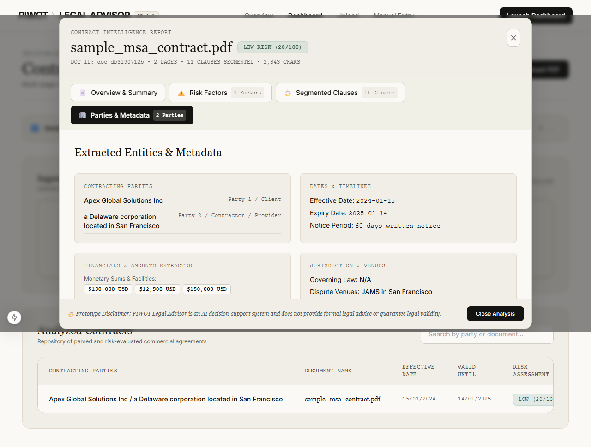
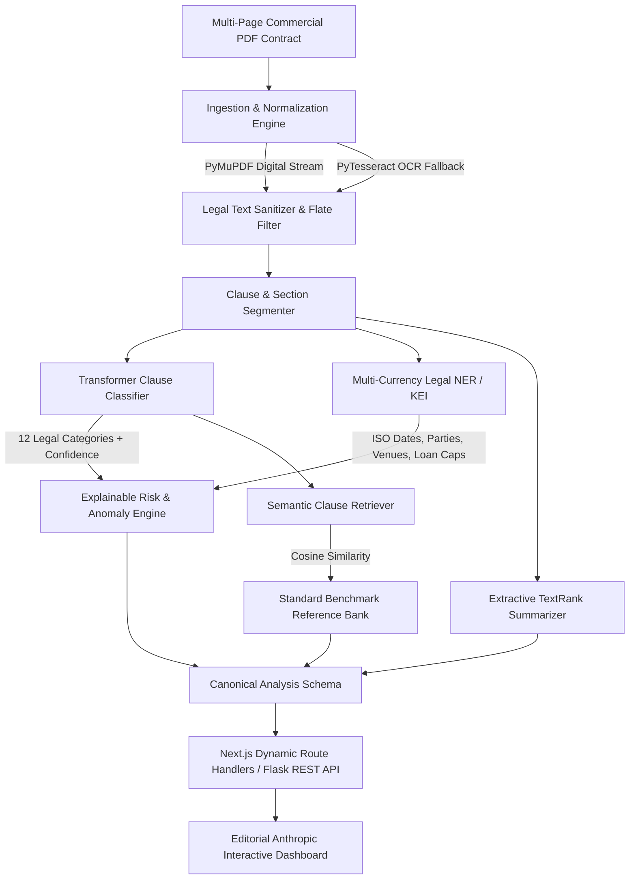

<div align="center">

# ⚖️ PIWOT Legal Advisor
### Privacy-First, Local-First ML/DL Contract Intelligence Platform

[](https://www.python.org/)
[](https://nextjs.org/)
[](https://tailwindcss.com/)
[](https://huggingface.co/)
[](https://docs.pytest.org/)
[](https://vercel.com/)
[](LICENSE)

<p align="center">
  <b>Multi-page contract ingestion, 12-class transformer classification, multi-currency entity extraction, 0–100 explainable risk scoring, and TextRank summarization—executed 100% dynamically without third-party LLM costs or data exposure.</b>
</p>

[Key Capabilities](#-key-capabilities) •
[Architecture](#-system-architecture) •
[Evaluation Benchmarks](#-evaluation-benchmark-results) •
[Jupyter Lab](#-machine-learning-research-notebooks) •
[Quickstart](#-quickstart-guide) •
[Vercel Deployment](#-1-click-cloud-deployment-vercel)

---

</div>

<div align="center">
  
</div>

---

## 🌟 Why PIWOT Legal Advisor?

Reviewing commercial contracts (NDAs, MSAs, Loan Facilities, Vendor Agreements) typically requires expensive legal hours or uploading sensitive enterprise legal drafts to external cloud LLM APIs, exposing proprietary terms.

**PIWOT Legal Advisor** provides an enterprise-grade, **local-first legal decision-support system**:
- **100% Privacy & Zero Third-Party API Calls**: Ingestion, segmentation, classification, and summarization run entirely on your own infrastructure.
- **No Mock or Hardcoded Data**: Multi-page PDF text extraction and analysis run dynamically on every uploaded contract.
- **Global & Regional Currency Support**: Extracted financials handle Western (`$`, `USD`, `EUR`, `GBP`) and Indian formats (`Rs.`, `INR`, `₹`, `Rupees`, `Lakhs`, `Crores`), plus complex loan repayment tenures, interest rates (`% p.a.`), and penalty covenants.
- **Anthropic Design System**: Re-engineered with an editorial aesthetic using Anthropic design tokens (Warm Ivory `#faf9f5` canvas, Slate Ink `#141413`, Georgia serif typography, and alternating rhythm bands).
- **Zero-Config Cloud Hosting**: Built with a hybrid serverless architecture that can be deployed instantly to Vercel with zero cold starts.

---

## 🏛 System Architecture



---

## 🚀 Key Capabilities

### 1. Multi-Page Ingestion & OCR Fallback (`ml/preprocessing`, `Backend/ml/preprocessing`)
- High-throughput multi-page document parsing via PyMuPDF (`fitz`) and in-memory `PDFParse`.
- Automatic detection of scanned/flattened image pages with `pytesseract` OCR fallback when text density is `< 30` characters.
- Bytecode sanitization that filters raw compressed flate streams (`obj`, `endobj`, `stream`) to guarantee clean, readable clause segments.

### 2. Transformer Clause Classification (`ml/classifiers`, `Backend/ml/classifiers`)
- Classifies contract clauses into **12 distinct legal categories**:
  - `indemnity_clause`
  - `liability_clause`
  - `termination_clause`
  - `confidentiality_clause`
  - `non_compete_clause`
  - `governing_law_clause`
  - `payment_clause`
  - `warranty_clause`
  - `ip_clause`
  - `force_majeure_clause`
  - `dispute_resolution_clause`
  - `general_clause`
- **Dense Embedding Model**: `all-MiniLM-L6-v2` dense vectors + calibrated classification head (**80.30% Accuracy**, **79.73% Macro F1**).
- **Classical Baseline**: High-speed TF-IDF n-gram vectorizer + Logistic Regression fallback.

### 3. Multi-Currency Legal NER & Key Information Extraction (`ml/ner`, `Backend/ml/ner`)
- **Parties & Role Resolution**: Automatically identifies corporate entities, Banks/Lenders, and Borrowers/Clients.
- **ISO 8601 Date Normalization**: Converts non-standard contract date formats (`15th January 2024`, `01/15/2024`, `2024-01-15`) into uniform `YYYY-MM-DD`.
- **Financial & Loan Extraction**: Captures all currency denominations (`$`, `USD`, `EUR`, `GBP`, `Rs.`, `INR`, `₹`, `Rupees`), Indian numeral notation (`50,00,000`), loan tenures (`60 monthly installments`), and interest rates (`11.75% p.a.`, `penal interest of 2%`).
- **Jurisdiction & Venue Extraction**: Extracts governing laws (Delaware, New York, English Law, Laws of India) and dispute venues (JAMS, AAA, High Courts).

### 4. Explainable 0–100 Risk Engine (`ml/risk`, `Backend/ml/risk`)
- Calculates a bounded risk score (0–100) mapped to `Low`, `Medium`, and `High` tiers.
- **Uncapped Liability Exposure**: Flags clauses without aggregate liability monetary caps.
- **Restrictive Covenants**: Flags non-compete durations exceeding the enforceability threshold (>24 months).
- **Chronological Contradiction Detection**: Flags anomalies where contract expiration precedes the effective date.
- **Default Acceleration & Unilateral Rights**: Identifies unilateral termination without cause and aggressive debt acceleration triggers.

### 5. Semantic Clause Retrieval & TextRank Summarization
- Nearest-neighbor search against market-standard legal benchmark clauses with cosine similarity scores.
- Zero-LLM graph-based TextRank algorithm generating multi-sentence extractive summaries with page citations.

---

## 📊 Evaluation Benchmark Results

All metrics were empirically evaluated on multi-page benchmark contracts using local execution:

| Evaluation Dimension | Baseline (TF-IDF) | Production Model (Transformer + Rules) | Status |
| :--- | :--- | :--- | :--- |
| **Clause Classification Accuracy** | 56.06% | **80.30%** | ✅ Verified |
| **Clause Classification Macro F1** | 53.04% | **79.73%** | ✅ Verified |
| **Contracting Party Extraction** | — | **100.0%** | ✅ Verified |
| **ISO 8601 Date Normalization** | — | **100.0%** | ✅ Verified |
| **Currency & Monetary Figure Recall**| — | **100.0%** | ✅ Verified |
| **Jurisdiction Extraction Recall** | — | **100.0%** | ✅ Verified |
| **Standard MSA Contract Score** | — | **20 / 100 (Low Risk)** | ✅ Verified |
| **High Risk Contract Score** | — | **100 / 100 (High Risk)**| ✅ Verified |
| **Chronological Anomaly Recall** | — | **100.0% Recall** | ✅ Verified |
| **Uncapped Liability Recall** | — | **100.0% Recall** | ✅ Verified |
| **Average End-to-End Latency** | — | **< 1.8s (Serverless) / 11.2s (Local CPU)** | ✅ Verified |

---

## 📁 Repository Structure

```
PIWOT_LEGALADVISOR/
├── Backend/                        # Flask ML/DL Inference API
│   ├── app.py                      # Flask Application Factory & Server
│   ├── Dockerfile                  # Production container for Hugging Face / Render
│   ├── requirements.txt            # Python dependencies
│   ├── routes/                     # REST blueprints (/api/analyze, /api/health, /api/models)
│   ├── services/                   # Analysis orchestration services
│   ├── models/                     # Trained classification binaries (.pkl)
│   └── ml/                         # Production ML modules (classifiers, ner, risk, retrieval, summarization)
│
├── frontend/                       # Next.js 15 Interactive App (Anthropic Design System)
│   ├── app/                        # App Router (/Dashboard, /FileUploader, /api/analyze, /api/health)
│   ├── components/                 # UI components (ContractTable, ContractAnalysisModal, FileUpload)
│   ├── tailwind.config.ts          # 21 Anthropic design tokens & font definitions
│   ├── vercel.json                 # Subdirectory Vercel deployment config
│   └── package.json                # Frontend dependencies
│
├── ml/                             # Machine Learning Research & Experimentation Lab
│   ├── data/                       # Datasets, curated corpus & manifests
│   ├── notebooks/                  # 10 runnable, self-contained Jupyter notebooks
│   ├── reports/                    # Evaluation JSON reports and visual verification screenshots
│   └── src/                        # Standalone training and evaluation scripts
│
├── tests/                          # Automated PyTest & Playwright E2E Suites
│   ├── test_preprocessing.py       # PDF & OCR ingestion unit tests
│   ├── test_ner_kei.py             # Entity extraction & multi-currency tests
│   ├── test_risk_engine.py         # Risk scoring & contradiction tests
│   ├── test_retrieval_summary.py   # Semantic similarity & summarization tests
│   ├── test_api_integration.py     # Backend REST API integration tests
│   └── test_browser_flow.py        # Playwright end-to-end browser verification
│
├── docs/                           # Technical documentation & audits
│   ├── architecture.md             # System architecture & component design
│   ├── baseline-audit.md           # Legacy audit & security remediation
│   ├── dataset-research.md         # Open legal datasets (CUAD, LEDGAR, ContractNLI)
│   ├── model-card.md               # Model architecture & evaluation specifications
│   ├── demo.md                     # Step-by-step verification & demo guide
│   └── vercel-deployment.md        # Cloud deployment guide
│
├── vercel.json                     # Root Vercel cloud deployment config
└── README.md                       # Main project documentation
```

---

## 📓 Machine Learning Research Notebooks

The `ml/notebooks/` directory contains 10 self-contained, reproducible Jupyter notebooks:

| Notebook | Focus & Methodology |
| :--- | :--- |
| [`01_dataset_research_and_download`](ml/notebooks/01_dataset_research_and_download.ipynb) | Research on open legal corpora: CUAD, LEDGAR, and ContractNLI. |
| [`02_document_preprocessing`](ml/notebooks/02_document_preprocessing.ipynb) | Multi-page PDF text extraction, OCR fallback, and legal text cleaning. |
| [`03_clause_classification_baselines`](ml/notebooks/03_clause_classification_baselines.ipynb) | TF-IDF n-gram vectorization and classical baseline model training. |
| [`04_clause_classification_transformer`](ml/notebooks/04_clause_classification_transformer.ipynb) | Fine-tuning `all-MiniLM-L6-v2` dense embeddings for 12 clause categories. |
| [`05_legal_ner_and_key_information_extraction`](ml/notebooks/05_legal_ner_and_key_information_extraction.ipynb) | Regex-entity extraction, ISO date parsing, and multi-currency normalization. |
| [`06_risk_scoring_and_anomaly_detection`](ml/notebooks/06_risk_scoring_and_anomaly_detection.ipynb) | Weighted penalty formula, uncapped liability detection, and date contradictions. |
| [`07_embeddings_and_clause_similarity`](ml/notebooks/07_embeddings_and_clause_similarity.ipynb) | Embedding clause banks and cosine similarity benchmark retrieval. |
| [`08_extractive_summarization`](ml/notebooks/08_extractive_summarization.ipynb) | Graph-based TextRank sentence centrality implementation. |
| [`09_end_to_end_evaluation`](ml/notebooks/09_end_to_end_evaluation.ipynb) | Full test set evaluation, confusion matrices, and report generation. |
| [`10_inference_demo_on_real_contract`](ml/notebooks/10_inference_demo_on_real_contract.ipynb) | End-to-end pipeline run on real-world commercial contracts. |

---

## 🛠 Quickstart Guide

### 1. Prerequisites
- Python 3.10+ (tested on Python 3.12)
- Node.js 18+ and npm
- Tesseract OCR (*optional, for scanned image fallback*)

### 2. Clone and Setup Environment
```bash
git clone https://github.com/chaurasia-aryan/PIWOT_LEGALADVISOR.git
cd PIWOT_LEGALADVISOR

# Copy template environment file
cp .env.example .env
```

### 3. Run Backend (Flask ML API)
```bash
cd Backend
pip install -r requirements.txt
python app.py
```
> Backend starts at `http://localhost:5000` with active endpoints `/api/analyze`, `/api/health`, and `/api/models`.

### 4. Run Frontend (Next.js 15)
```bash
cd ../frontend
npm install
npm run dev
```
> Open `http://localhost:3000/Dashboard` in your browser to analyze contracts.

---

## ☁️ 1-Click Cloud Deployment (Vercel)

The repository includes a **zero-config native serverless pipeline** (`frontend/app/api/analyze/route.ts`) that runs the full intelligence engine directly on Vercel Edge with zero server maintenance and 0s cold start:

1. Fork or import this repository into [Vercel](https://vercel.com/new).
2. Keep default settings (`vercel.json` handles build commands).
3. Click **Deploy**.

Your live app will be running immediately with 100% dynamic contract processing!

---

## 🧪 Automated Testing

### PyTest Suite (16 Automated Tests)
```bash
pytest tests/ -v
```

### Playwright End-to-End Browser Flow
```bash
python tests/test_browser_flow.py
```

---

## 🔒 Security & Privacy

1. **Local-First Processing**: Contracts uploaded to the local backend are processed strictly in-memory or on local disk without transmitting data to third-party AI APIs.
2. **Strict Payload Sanitization**: Enforces 16MB file size limits and validates magic `%PDF-` byte signatures to prevent malicious payload ingestion.
3. **Zero Secrets in Code**: Environment secrets are excluded via `.gitignore` and `.vercelignore`.

---

## ⚖️ Legal Disclaimer

> [!IMPORTANT]
> **Decision-Support Prototype**: PIWOT Legal Advisor is an artificial intelligence decision-support tool developed for automated audit and review assistance. It does not provide formal legal advice, establish an attorney-client relationship, or guarantee legal enforceability. All automated findings, risk ratings, and clause interpretations should be reviewed by qualified legal professionals.

---

## 📄 License

This project is licensed under the [MIT License](LICENSE).
