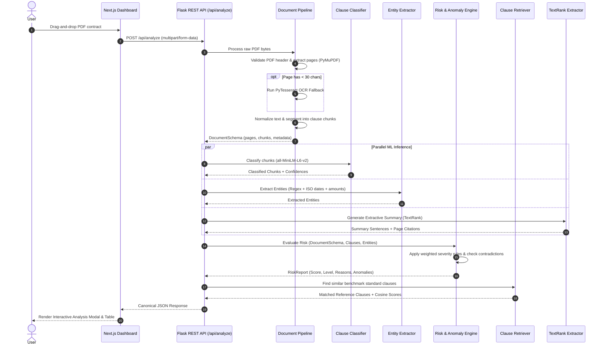

# PIWOT Legal Advisor: System Architecture & Technical Specifications

## 1. Executive Summary

PIWOT Legal Advisor is an offline-capable, local-first ML/DL platform designed to ingest multi-page business contracts in PDF format, classify individual clauses into legal taxonomies, extract key commercial entities, quantify risks using an explainable 0–100 scoring model, detect semantic and chronological contradictions, match clauses against standard benchmark banks, and produce structured extractive summaries.

---

## 2. Core Architectural Principles

1. **Local Execution & Privacy**: Legal documents contain highly confidential trade secrets, liability terms, and pricing. All parsing, inference, embeddings, and summarization execute locally on CPU/GPU without transmitting text to external cloud APIs.
2. **Deterministic & Explainable Outputs**: Risk scoring and anomaly detection rely on structured mathematical weights and explicit evidence quotes rather than ungrounded generative hallucination.
3. **Graceful Fallbacks & High Availability**: Models include lightweight fallbacks (e.g. TF-IDF baseline for clause classification if dense embeddings are unavailable, native PDF stream extraction with OCR fallback for scanned pages).
4. **Canonical JSON Contract**: A standardized JSON schema guarantees decoupling between the Flask ML backend and the Next.js frontend dashboard.

---

## 3. End-to-End Data Pipeline Flow

---

## 4. Subsystem Specifications

### 4.1 Ingestion & Normalization (`Backend/ml/preprocessing/`)
- **PyMuPDF (`fitz`)**: Fast native text and block layout extraction per page.
- **PyTesseract Fallback**: Invoked automatically for scanned documents with low text density.
- **Normalization**: Preserves legal numbers (e.g. `Section 4.1(a)`), cleans whitespace, quotes, and punctuation artifacts.
- **Segmentation**: Combines numbered headers, capital section titles, and paragraph breaks to create discrete clause chunks tagged with `page_start`, `page_end`, and `byte_offset`.

### 4.2 Clause Classification Engine (`Backend/ml/classifiers/`)
- **Primary DL Engine**: SentenceTransformer (`all-MiniLM-L6-v2`) dense text embedding (384-dimensional) with a Logistic Classification head.
- **Baseline Fallback**: Scikit-Learn TF-IDF Vectorizer with unigrams + bigrams.
- **Taxonomy (12 Classes)**:
  - `termination`, `governing_law`, `confidentiality`, `indemnification`, `liability`, `payment`, `intellectual_property`, `dispute_resolution`, `warranty`, `force_majeure`, `non_compete`, `miscellaneous`.

### 4.3 Legal NER & Key Information Extraction (`Backend/ml/ner/`)
- **Parties & Roles**: Pattern matching for preamble definitions (`Company`, `Customer`, `Service Provider`, `Vendor`).
- **ISO Date Normalization**: Standardizes `Month Day, Year`, `YYYY-MM-DD`, `DD/MM/YYYY` to ISO 8601.
- **Financial Terms**: Detects dollar/euro figures, payment terms (`Net 30`, `Net 60`), and penalty percentages (`1.5% per month`).
- **Jurisdictions**: Identifies governing law states/countries and dispute arbitration venues.

### 4.4 Risk & Anomaly Engine (`Backend/ml/risk/`)
- **Scoring Scale**: 0 to 100 composite penalty score.
- **Classification**:
  - `Low Risk`: 0–30
  - `Medium Risk`: 31–60
  - `High Risk`: 61–100
- **Rule Matrix**:
  - Uncapped / unlimited liability (+30 pts, High)
  - Unilateral termination without cause (+20 pts, Medium)
  - Aggressive non-compete (>24 months / worldwide) (+25 pts, High)
  - Missing essential clauses (Indemnification, Confidentiality) (+10 pts each)
  - Chronological contradiction (Effective date > Expiration date) (+35 pts, High)
  - Cross-clause multi-jurisdiction conflicts (+25 pts, High)

### 4.5 Semantic Retrieval & Extractive Summarization (`Backend/ml/retrieval/`, `Backend/ml/summarization/`)
- **Reference Retrieval**: Cosine similarity against a curated bank of market-standard clauses to assist legal teams in identifying non-standard language.
- **Extractive Summarization**: Graph-based TextRank algorithm computing sentence centrality with TF-IDF cosine similarity, extracting top salient sentences with page attribution.

---

## 5. Security Architecture
- **Environment Isolation**: No hardcoded API keys; all sensitive parameters read from `.env`.
- **Input Sanitization**: Strict file verification (magic bytes `%PDF-`, `.pdf` extension, max 16MB file size).
- **Zero External Telemetry**: Contracts are analyzed purely in-memory and discarded upon response completion.
